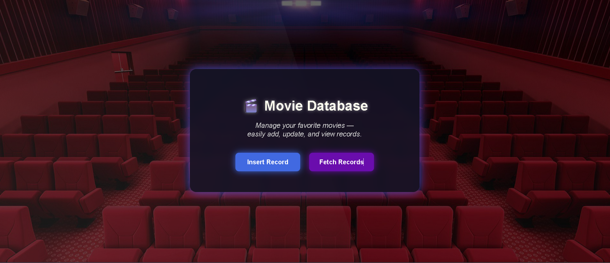
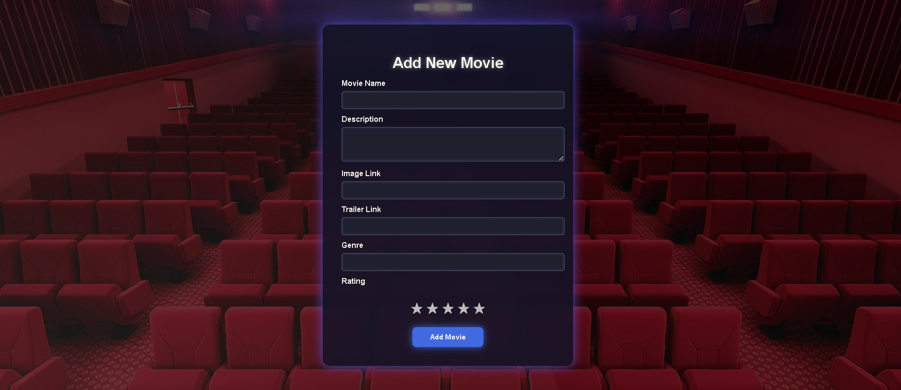
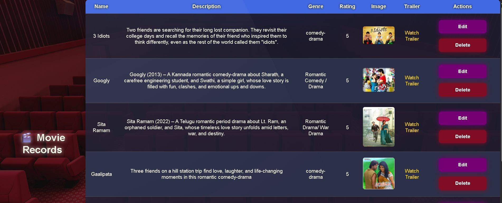

# 🎬 Movie CRUD Web Application

A simple and interactive web application built using **Spring Boot**, **Thymeleaf**, **HTML**, **CSS**, and **Java**.  
This project allows users to **add, view, update, and delete** movie records — each containing title, genre, description, rating, and trailer link.

-------

## 📌 Features

- ➕ Add new movie details  
- 👀 View all movies in a clean tabular format  
- ✏️ Update movie information  
- ❌ Delete movie records  
- 🌐 Open trailer links directly  
- 💾 Data stored using MySQL via Spring Data JPA  

-------

## 🛠️ Tech Stack

- Backend: Spring Boot, Java  
- Frontend:Thymeleaf, HTML, CSS  
- Database:MySQL   
- Build Tool:Maven  

----------

## 📸 Screenshots

| Home Page | Add Movie | Movie List |
|------------|------------|------------|
|  |  |  |

----------

[GitHub Repo] https://github.com/sahanahc6s/Movie-Crud  
Made with ❤️ by Sahana HC   